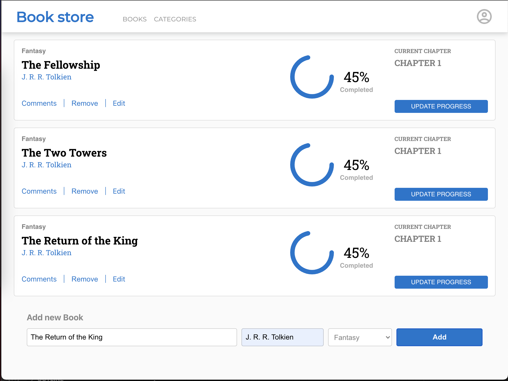

# Project Name

> One paragraph statement about the project.

## About

## Built With

- JavaScript
- React Redux
- 

## Live Demo

[Live Demo Link](https://livedemo.com)

## Getting Started

**This is an example of how you may give instructions on setting up your project locally.**
**Modify this file to match your project, remove sections that don't apply. For example: delete the testing section if the currect project doesn't require testing.**

To get a local copy up and running follow these simple example steps.

### Prerequisites
- Chrome browser
- Node v14.XX >
- npm (usually already installed with current node version)

### Setup
To run code locally, please follow steps belove
1. `git clone git@github.com:marijanbrvar/BookStore.git && cd math-magicians-app`
2. run `npm install`
3. then run `npm run start`

### Install

### Usage

## Authors

👤 MARIJAN BRVAR

- GitHub: [@githubhandle](https://github.com/marijanbrvar)
- Twitter: [@twitterhandle](https://twitter.com/marijanbrvar)
- LinkedIn: [LinkedIn](https://linkedin.com/in/marijanbrvar)

## 🤝 Contributing

Contributions, issues, and feature requests are welcome!

Feel free to check the [issues page](../../issues/).

## Show your support

Give a ⭐️ if you like this project!

## 📝 License

This project is [MIT](./MIT.md) licensed.
